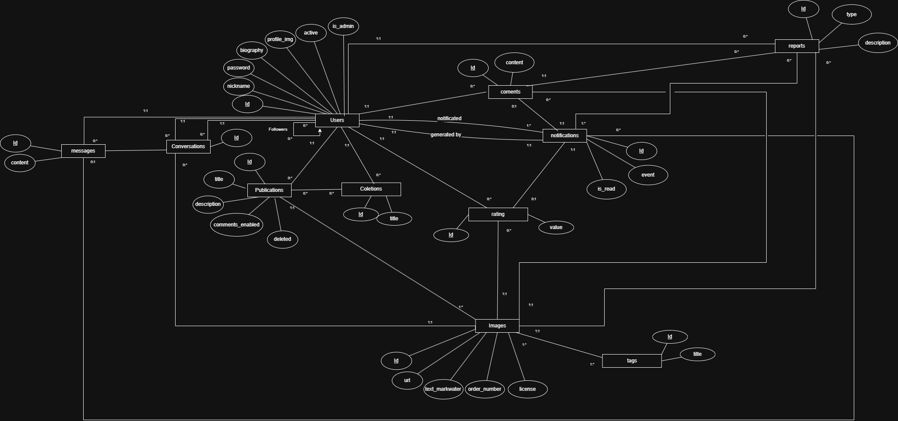
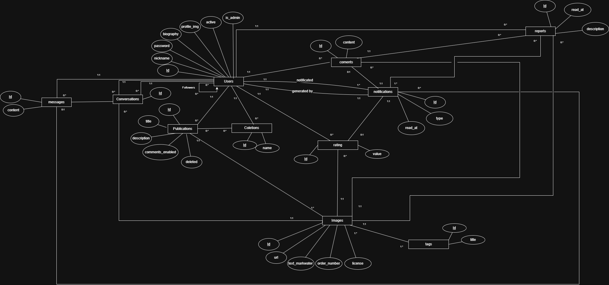
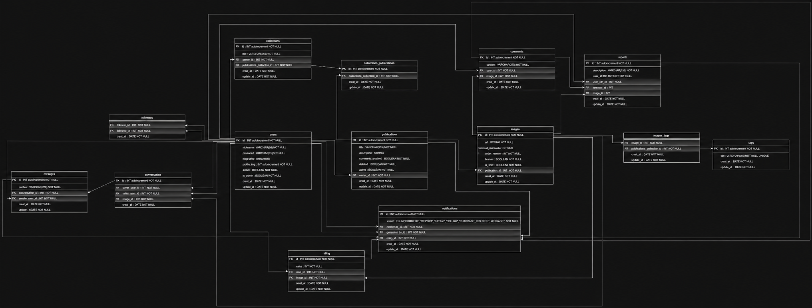
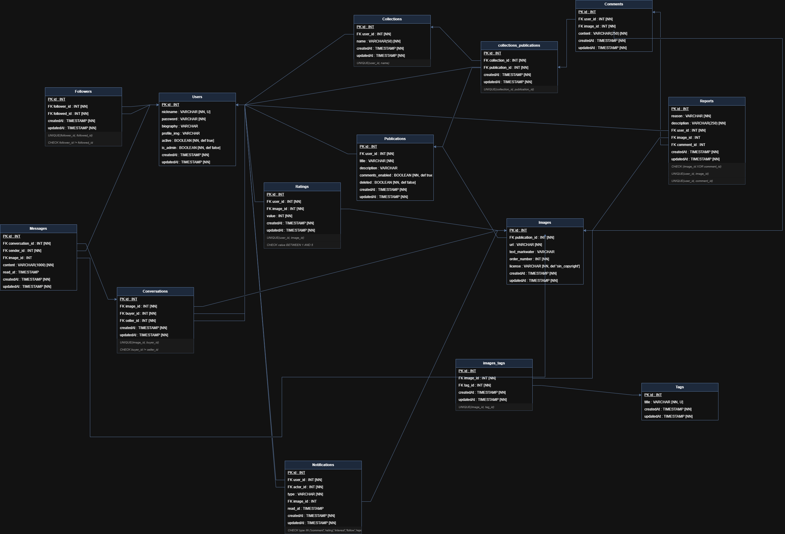

# Fotaza  2

## Objetivos 

- Desarrollar y poner en práctica los conocimientos adquiridos en la asignatura a partir del desarrollo de un caso de estudio. 

## Especificación del problema

- App Web que permita almacenar , ordenar , buscar , vender y compartir fotografias en linea , atraves de internet.

## Requerimientos minimos

- Autenticacion de usuarios.
  - Solo usuarios registrados y autenticados podran publicar imagenes en el sitio.
  - Usuarios anonimos podran ver contenido sin copyright.
- Gestion de contenido.
  - Podran postear publicaciones con titulo, descripcion (opcional), varias imagenes y varias etiquetas.
  - Las imagenes se podran denunciar con motivo y descripcion. Si la publicacion tiene una denuncia no se podra editar.
    Si la publicacion tiene 3 denuncias pasara a una lista negra que vera el admin , donde puede desetimarlas o dar de baja la publicacion.
    Si el usuario tiene 3 publicaciones dadas de baja se inactivara su cuenta.
  - Se podran comentar las imagenes de la publicacion. Esta seccion se podra desactivar por el propietario , pero se vera el historial antes de que lo hiciera.
    Los comentarios pueden denunciarse (motivo y descripcion), solo el propietario podra verlas. El propietario puede borrar comentarios de sus publicaciones.
  - Las imagenes podran valorizarse por usuarios que no son propietarios de la publicación. Las imagenes mostraran una valorizacion promedio y la cantidad de las mismas.
  - El Home del usuario priorizara publicaciones con mayor valorizacion promedio y mayor cantidad de valorizaciones, pero debe haber un balance con las demas.
  - Las imagenes de cada publicacion tendran dos tipos de licencia, copyright y sin copyright. Cuando la imagen tenga la licencia copyright debera tener una marca de agua
    personalizada por el usuario.
  - Las imagenes tendran un boton "Quiero adquirirla" que notificara al propietario el perfil que desea hacerlo. Se debe proporcionar una mensajeria para que la transaccion 
    se lleve acabo.

- Motor de búsqueda de contenidos.
  - Se debe poder buscar imagenes/publicaciones.
  
- Seguimiento de usuario (Followers) 
  - Los usuarios podran seguir perfiles y otros perfiles los podran seguir. Un usuario no se podra seguir a si mismo y no se puede seguir mas de dos veces a un mismo usuario.
  
- Gestor de notificaciones
  - Los usuarios tendran una gestion de notificaciones que notificara de eventos como comentarios nuevos, valorizaciones nuevas de sus propias imagenes, intencio de adquirir 
    sus imagenes y nuevos seguimientos de usuarios.

- Gestión de colecciones o favoritos
  - Los usuarios podran guardar publicaciones en una seccion de favoritos que solo podra ver el propio usuario. Esta estara dividida en colecciones , las cuales no pueden tener 
    la misma publicacion repetida.

## Diagrama Entidad Relacion v1


## Diagrama Entidad Relacion v2 (final)


## Diagrama Relacional v1


## Diagrama Relacional v2 (final)


## Tecnologias usadas

- Node.js + Express 5 (backend)
- Pug para renderizar las vistas del lado del servidor
- PostgreSQL + Sequelize (ORM y migraciones)
- Tailwind CSS para los estilos
- Cloudinary para guardar las imagenes y aplicar transformaciones
- Socket.IO para la mensajeria y las notificaciones en tiempo real
- JWT (cookies) + bcrypt para la autenticacion
- Zod para validar los datos

## Requisitos previos

- Node.js 18 o superior
- PostgreSQL instalado y corriendo
- Una cuenta de Cloudinary (para subir imagenes nuevas)

## Instalacion y ejecucion en local

```bash
# 1. Clonar el repositorio
git clone https://github.com/NelsonValentinGarroDadan/TPI-Web2-Fotaza-2.git
cd TPI-Web2-Fotaza-2

# 2. Instalar dependencias
npm install

# 3. Copiar el archivo de ejemplo y completar los valores
cp .env.example .env

# 4. Crear la base de datos vacia en PostgreSQL (toma el nombre de DB_NAME del .env)
npm run db:create

# 5. Crear las tablas (migraciones)
npm run db:init

# 6. Cargar los datos de prueba (opcional pero recomendado)
npm run db:seed

# 7. Levantar el servidor
npm start
```

La app queda accesible en http://localhost:3000.

### Alternativa: restaurar desde la copia de seguridad

En la raiz del proyecto hay un `backup.sql` con el esquema completo y los datos de
prueba. Si preferis levantar la BD de una sola vez (en lugar de `db:init` + `db:seed`):

```bash
npm run db:create
psql -h localhost -U postgres -d fotaza2 -f backup.sql
```

Para desarrollo puedo usar `npm run dev` (recarga automatica) y en otra terminal `npm run dev:css` para compilar Tailwind en modo watch.

## Variables de entorno

Estan documentadas en el archivo `.env.example`. Hay que crear un `.env` a partir de ese ejemplo:

- `PORT` - puerto del servidor (por defecto 3000)
- `DB_HOST`, `DB_USER`, `DB_PASSWORD`, `DB_NAME` - conexion a PostgreSQL
- `CLOUDINARY_CLOUD_NAME`, `CLOUDINARY_API_KEY`, `CLOUDINARY_API_SECRET` - credenciales de Cloudinary
- `DEFAULT_PROFILE_IMG` - ruta de la imagen de perfil por defecto
- `JWT_SECRET`, `JWT_EXPIRES_IN` - firma y expiracion del token de sesion
- `NODE_ENV` - entorno (development / production)

## Usuarios de prueba

Estos usuarios se cargan con `npm run db:seed`. El login es por nickname.

- Contraseña para todos: `Password123!`

- `admin` - rol validador / administrador. Es el unico que entra al panel `/admin` (cola de denuncias, dar de baja o desestimar publicaciones).
- `ana` - usuario comun, fotografa de paisajes.
- `beto` - usuario comun, fotografia urbana. Tiene el escenario de cuenta con publicaciones dadas de baja.
- `caro` - usuario comun, retratos.
- `dami` - usuario comun, naturaleza y fauna.
- `eli` - usuario comun, fotos de viajes.

Ademas del usuario, el seed deja cargado contenido de ejemplo: publicaciones con imagenes y etiquetas, valoraciones, comentarios, seguimientos, colecciones, notificaciones, conversaciones de mensajeria y un escenario de denuncias (incluida una imagen que supera las 3 denuncias y cae en la cola del validador).

## Problemas que encontre y como los resolvi

### No sabia como implementar websocket

Para la mensajeria privada en tiempo real necesitaba websockets y no sabia por donde arrancar, era la primera vez que trabajaba con esto. Lo resolvi buscando documentacion y mirando varios videos en YouTube hasta entender bien como funcionaban los eventos. Termine integrando Socket.IO sobre el mismo servidor de Express y usando una sala por usuario para que cada mensaje y notificacion le llegue solo a quien corresponde.

### El tamaño de las imagenes

Tuve problemas con el tamaño de las imagenes, sobre todo en la foto de perfil y en el detalle de la publicacion. Si la imagen era muy grande tardaba en cargar y rompia el diseño, y si era muy chica se veia pixelada. Lo solucione usando las transformaciones de Cloudinary: en vez de mostrar la imagen original, pido una version ya redimensionada segun donde se muestre, asi siempre llega con el tamaño justo sin importar como la haya subido el usuario.


## Deploy
 <a href="https://fotaza-2-21ji.onrender.com/" > Fotaza 2 </a>

## Video de presentacion
  <a href="https://youtu.be/349SuzdXtWU" > Video de YouTube </a>